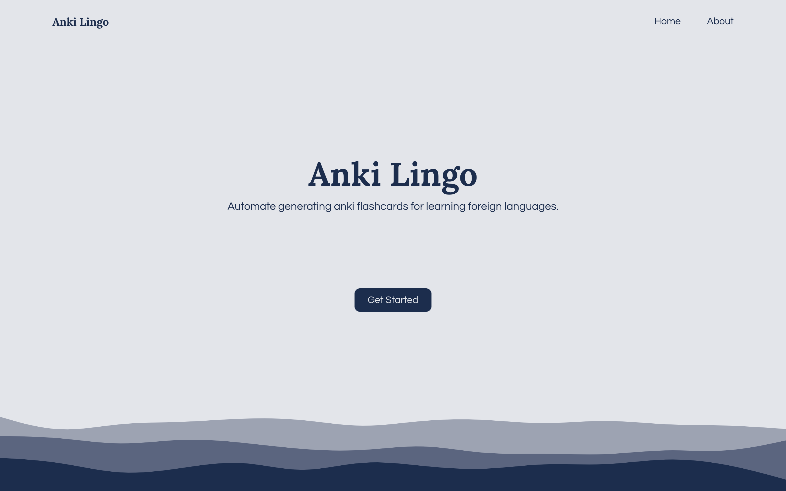
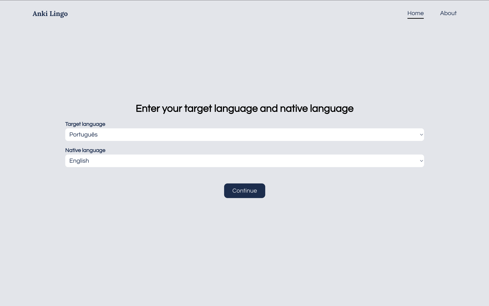
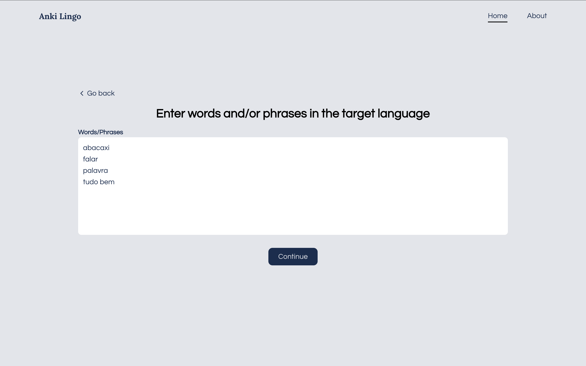
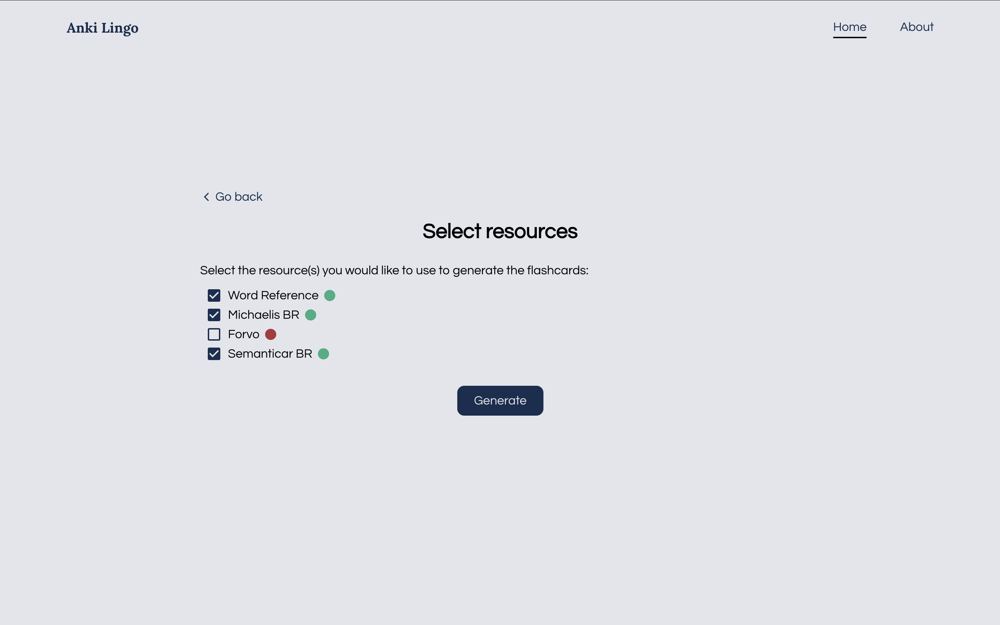
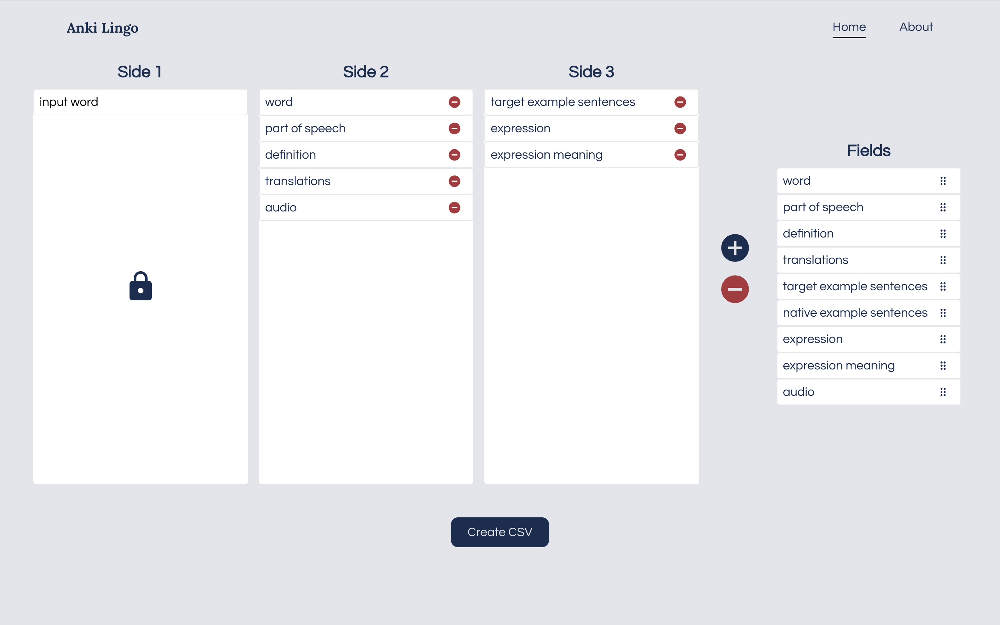
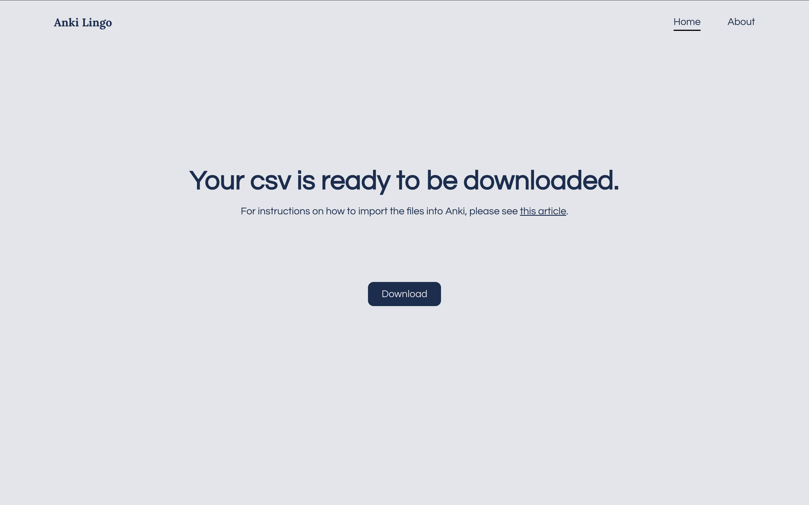
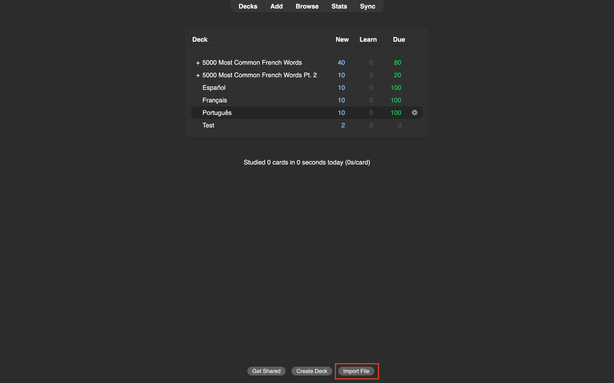
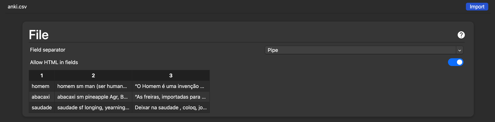
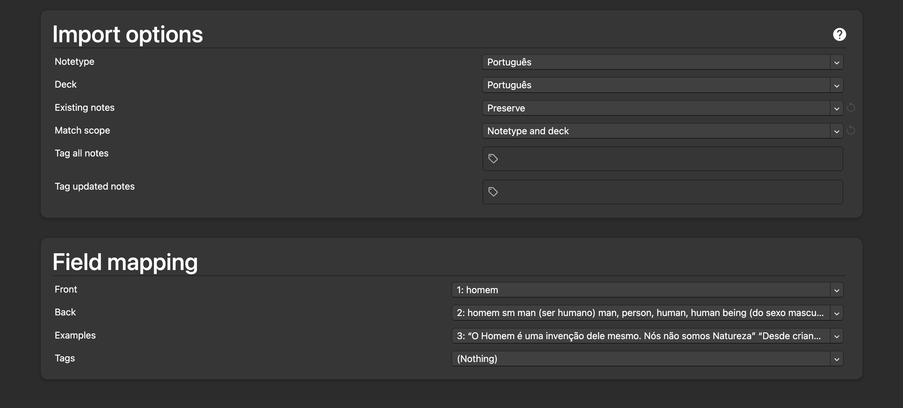

# Anki Lingo
**Anki Lingo** is a React and Flask application for generating Anki flashcards for learning languages. It scrapes popular language learning sites like Word Reference, SpanishDict, and Forvo to fetch translations, example sentences, and much more!

It is currently hosted at https://anki.taylorbarmak.com.



The user starts by entering their native and target languages.



Next, the user enters words and phrases in the target language.



Next, the user selects which resources they would like to scrape from.



Resources have health checks to validate that the sites are being scraped as expected. It is indicated as healthy with a green circle, or unhealthy with a red circle. A resource can become unhealthy if:
1. The resource blocks traffic from the IP address where Anki Lingo is being run
2. The resource website structure was updated in a way that breaks the current scraping logic

After clicking the "Generate" button, the resources will be scraped.

After the information is scraped, the user can design the flashcards by selecting which fields to include, and which side to put them on. For example, I prefer to put example sentences in the target language on a separate side.




Lastly, the CSV can be downloaded and imported into Anki. When you click the "Download" button, a zip file will be downloaded with name `anki-lingo-<timestamp>.zip`.

Expand the zip file to get the `anki.csv` and the `audio_files`, if applicable.

### Importing CSV into Anki
In Anki, click "Import File"



and select the `anki.csv` file from the expanded zip.

Make sure the "Field separator" is "Pipe", and that "Allow HTML in fields" is toggled on.



Update the "Import options" and "Field mapping" according to how you designed your flashcards.



Finally, click the "Import" button.

### Importing Audio Files into Anki
In order for the audio to work properly, the files from the zip must be copied into the Anki media folder. Refer to the [Anki docs](https://docs.ankiweb.net/files.html#file-locations) for specifics for each machine.


On mac, it's in the `~/Library/Application Support/Anki2` folder. I just added the following alias to easily open the folder that the files need to be copied into:
```bash
alias ankim='open ~/Library/Application\ Support/Anki2/User\ 1/collection.media'
```

## Frontend (React)
The frontend is built with React and Typescript. The UI allows the user to enter words and phrases in the target language.

## Backend (Flask)
The Flask (Python) backend uses Beautiful Soup to scrape popular websites.

## Running Locally Without Docker
1. Clone the repo with `git clone https://github.com/TBarmak/anki-lingo.git`
2. `cd anki-lingo`
3. Install the UI dependencies with `npm i`
4. `cd api`
5. Create a virtual env for python with `python -m venv env`
6. Activate the virtual environment with `source env/bin/activate`
7. Install the python dependencies in the virtual environment with `pip install -r requirements.txt`
8. In a new terminal, from the root of the repo, run `npm run start-api` to start the api.
9. In another terminal tab, run `npm run dev` to start the UI.
10. Open `http://localhost:5173/` in the browser!

## Running Locally With Docker
** Note that some sites may be blocked when using the docker implementation
1. Clone the repo with `git clone https://github.com/TBarmak/anki-lingo.git`
2. `cd anki-lingo`
3. `docker-compose up`
4. Open `localhost:8080` in the browser!