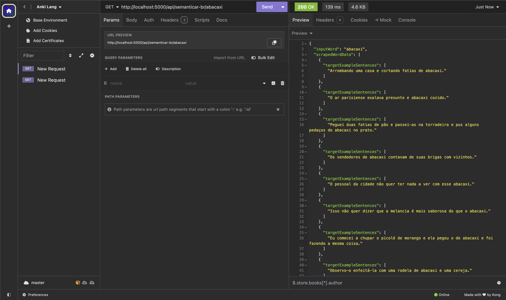
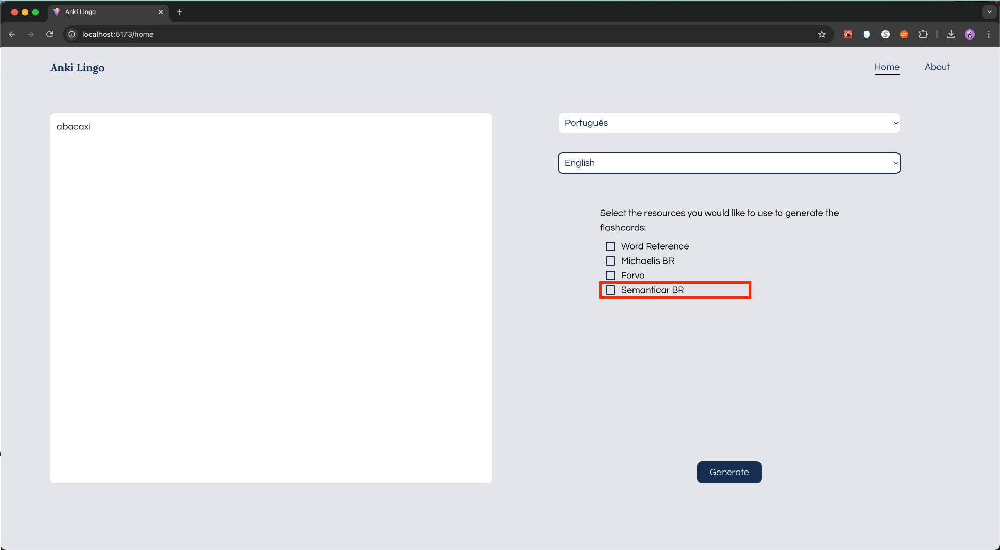

# Creating New Scraping Endpoint

1. Copy `api/scrapers/template.py` and rename it to something that corresponds to the site that you'll be scraping (ie `word_reference.py`).
2. Update the `create_url` function to generate the url for the site based on the word. Add additional arguments for target and/or native language, if necessary. For example:

```python
def create_url(word):
    return f'https://www.semanticar.com.br/{quote(word)}'
```

3. Play around with Jupyter Notebook to determine the best way to parse the soup.
4. Have the `scrape_<site>` function return a list of objects, and the url as a string. Example:
   ```python
   def scrape_semanticar(word):
       url = create_url(word)
       r = requests.get(url)
       soup = BeautifulSoup(r.text, 'html.parser')
       sentence_objects = get_sentences(word, soup)
       return sentence_objects, url
   ```
   1. The objects in the list must have a subset of the following as keys:
      - `inputWord`: str
      - `word`: str
      - `pos` (part of speech): str
      - `definition`: str
      - `translations`: str[]
      - `targetExampleSentences`: str[]
      - `nativeExampleSentences`: str[]
      - `audioFilenames`: str[]
      - `expression`: str
      - `expressionMeaning`: str
   2. The `url` is to make sure to be able to provide a link to the original site.
5. Copy over the code from Jupyter Notebook to the file you created in Step 1.
6. Go to `api.py` and add a new route for your endpoint.
   Example:
   ```python
   @app.route('/api/semanticar-br/<word>')
   ```
7. Import your scrape function from the file you created in Step 1, and call it in the endpoint function.
   Example:
   ```python
   @app.route('/api/semanticar-br/<word>')
   def get_semanticar_br_word(word):
       scraped_data, url = scrape_semanticar(word)
   ```
8. Make sure your endpoint returns in the form  
   ```python
   return {'inputWord': word, 'scrapedWordData': scraped_data, 'url': url}
   ```
9. Test your endpoint with Insomnia/Postman  


10. Update the `LANGUAGE_RESOURCES` object with the necessary information for it to appear in the UI. Example:  
   ```python
   {
      "name": "Semanticar BR",
      "route": "api/semanticar-br/",
               "args": ["word"],
               "outputs": ["targetExampleSentences"],
               "supportedLanguages": ["português"]
   }
   ```
11. Spin up the UI, and select an applicable language.
12. Enter some test words and select the appropriate languages from the dropdown.
13. Confirm that your new resource appears as one of the options.  

14. Try it out and import the resulting file into Anki to confirm that it looks as expected. 
15. Congratulations!
